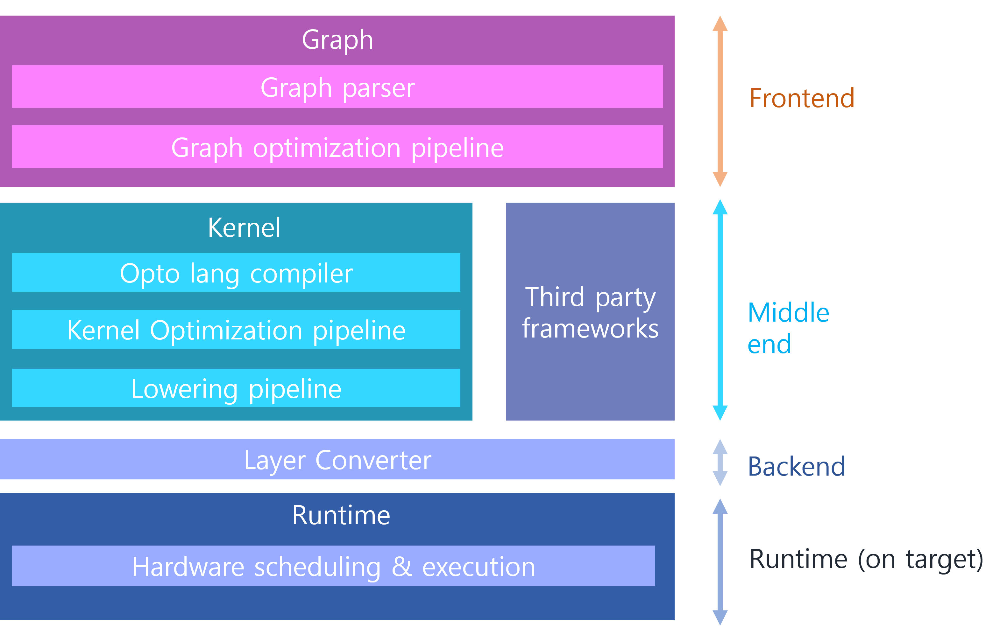

# What is a Optima?
Optima V2 is a deep learning model inference engine that compiles & optimizes pre-trained model for fast & efficient on various target hardware

OptimaV2 considers **operating-system driven targets as a first-priority**. We are aiming to provide **hugely improved flexibility and optimization performance**

## What is Optima's Objective?

- Make easy to deploy AI models into various device targets
    - It reduce AI engineers' conversion effort to make their model compatible in their device(s)
- Make AI models run fast in edge device
    - It provides short inference time compared to existing solutions such as tflite
- Make easy to add customized layer
    - It extends the scope of AI researchers by supporting complex operations that are not compatible with MHLO, TOSA, and other similar technologies."

### (Desired) Features
- **Reasonably light and fast inference time**
    - our first target is to surpass tensorflow(tf-lite), and we will aim to target tvm based compilers
- **Reasonably fast compile time**
    - Compile time should not take too long for the user
- **Quantization support (Not part of  MVP requirement)**
    - Supports not only importing quantized models but various quantization scheme
- **Simple and concise user interface**
    - GUI may be provided in the near future
- **Provides flexibility for importing various kinds of models**
    - It provides wide range of available operations
- **Supports multiple targets**
    - CPU (ARM & x86_64)
    - GPU (cuda, vulkan, opencl)
    - NPU (hexagon, ambarella npu, intel vpu, kinara NPU)
    - Heterogeneous setting

## Optima Composition
Optima can be divided by four part including runtime as illustrated below

### Front-end
- It covers all work to be done in graph level
- It takes networkx graph and parse it to convert into Optima graph
- It optimizes a graph level optimization such as graph fusion, graph spliting

### Middle-end
- It covers all work to be done in kernel(operation) level
- It provides our own language called Opto to support various and complex operation
- It optimizes a kernel level optimization such as tiling, packing
- It lowers all kernels into formats which can be compiled and built by target devices' compiler such as LLVM compiler or GCC

### Back-end
- It compiles and builds all lowered kernel in middle-end
- It provides all files which should be delivered into Optima Runtime to run AI model in target device(s)

### Runtime
- It dynamically loads results of Optima and runs AI model
- It provides user C++/Python API(s) to run AI model only with a few lines of codes

## Issue tracker
If you have any issue and need an assistance, then please feel free to upload your requirement in http://192.168.0.80:8080/
