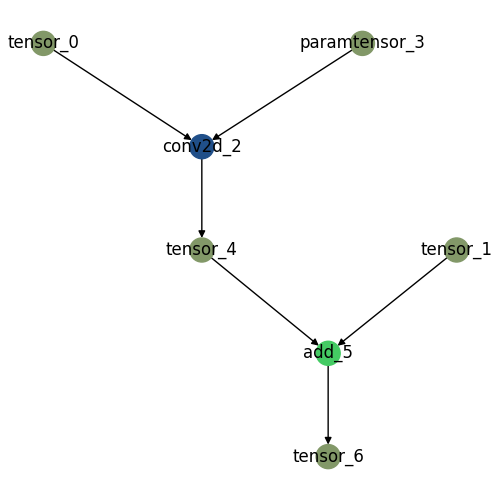

# How to convert your ML model and compile it
This section introduces how to convert your ML model into OptimaIR and then compile it into dynamic library (which will be used to deploy your model in your target device using runtime. please refer to [User Guide/Inference](inference.md)).

This section is again divided by two steps

1. convert ML model(Pytorch, for now) to networkx model and allocate each operation into device(s)
    1. User provide ML model (for now, only torch is available) and converts it into networkx which should be saved in "gpickle" format using *torch2nx* library. 

    2. User creates "json file" that enumerates which device is allocated for each operation in graph. [^1] 

2. Takes above mentioned files (gpickle and json) and then converts into binary (TO BE REWRITTEN BELOW)
    1. initialize graph module
    2. allocate kernel
    3. kernel compile
    4. graph split
    5. extract representative dataset
    6. export to runtime
    7. convert onnx

## convert ML model to networkx model

### how to create gpickle file for networkx model
You should prepare two things 1) install package 2) ready to provide a model

- you should install *torch2nx* and be able to import *zaiConverter*
- you should provide pytorch model as a torch.nn.Module instance and sample input data (as a list and order must match with that of arguments in forward method of provided model) to feed into the model. Following is an example

````python
  
import torch
import torch.nn as nn

class SampleModel(nn.Module):
    def __init__(self):
        super(SampleModel, self).__init__()
        self.conv = nn.Conv2d(3, 1, 3, 1, 1, bias=False)
    def forward(self, x, y):
        out1 = self.conv(x)
        out2 = out1 + y
        return out2

# model and sample_input_data will be used in the below code block
model = SampleModel()
sample_input_list = [torch.rand(1, 3, 32, 32), torch.rand(1, 1, 32, 32)] # shape of each arguments matches with that of tensor x and tensor y
````

Now, you provide a model and sample data to get a gpickle file

````python
import zaiConverter
from zaiConverter.pytorch_module import converter

# Convert model to Networkx specification
need_gpu = True # or False
temp_gpickle_save_filename = "<SOME PATH WHERE GPICKLE WILL BE SAVED>"
graph_converter = converter.Torch2GraphConverter(tf_flip=True, torch_flip=False)
nx_graph = graph_converter.convert(
    model=model, fake_torch_data=sample_input_list, gpu=need_gpu
)
graph_converter.reset_module()
graph_converter.export_to_gpickle(temp_gpickle_save_filename, nx_graph)
````

Device allocation json file is a json file that indicates which device(processor) is assigned for each operation.

For example, the above "SampleModel" contains two operations - convolution and add. Then you should allocate device(s)/processor(s) available in your target device into the two operations. 

The required json file has key-value pairs of which key is an operation name and value is an allocated devices. Supported devices is as follows [^3]:

+ "X86",
+ "X64", - tested
+ "ARM",
+ "ARM64",
+ "NVIDIA",
+ "AMDGPU",
+ "INTELGPU",
+ "MALI",
+ "ADRENO",
+ "HEXAGON", - tested
+ "MYRIAD",
+ "ARA1",
+ "TPU",
+ "CV22",

To generate json file, you must create a template json providing a default device.[^2]

````python
import pickle
import networkx as nx
import json
# Create json file #
model_json_filename="<SOME PATH WHERE JSON WILL BE SAVED>"
default_device="<SOME DEVICE>" # You must select among above candidates
alloc_dict = {}
with open(temp_gpickle_save_filename, "rb") as f:
    generalized_graph = pickle.load(f)
    for node_name in nx.topological_sort(generalized_graph):
        nx_dict = generalized_graph.nodes[node_name]["data"]
        if nx_dict["kind"] == "OpNode":
            alloc_dict[node_name] = (
                default_device + ":0"
            )

with open(model_json_filename, "w") as f:
    json.dump(alloc_dict, f)
````

Then you should get a json file like following:
````json
{"conv2d_2": "X64:0", "add_5": "X64:0"}
````

You can customize this json file as you want like following (this example indicates that convolution operation is run on hexagon and then add tensors on x86-64 architecture processor)
````json
{"conv2d_2": "HEXAGON:0", "add_5": "X64:1"}
````

**Graph visualization**

Device allocation is much easier when visualization of graph is provided. To visualize the graph, you should install *pygraphviz*
````bash
# (Linux)
sudo apt-get install graphviz graphviz-dev
pip install pygraphviz
# (For other OS, please refer to https://pygraphviz.github.io/documentation/stable/install.html)
````

Following code let you know how to allocate each operation using graph illustration.[^4]
````python
from pathlib import Path
visual_graph_dir = "<SOME DIRECTORY PATH WHERE VISUALIZED GRAPH WILL BE SAVED>"
visual_graph_filename = "<VISUALIZED GRAPH FILENAME>"
graph_converter.plot_network(Path(visual_graph_dir), visual_graph_filename, \
                             model_json_filename, figsizenum=5)
````

Then you may get image which illustrates subgraph allocated model graph. There will be (n+1) colors. "n" is a number of devices used in json and one color is for all tensors (either dynamic or static). By controlling figsizenum (from 5 to about 40), you can adjust image size.



## compile

[^1]: sample input 만드는 것은 manager가 사용할 것이고 optional이기 때문에 2번 step에서 설명하면 좋겠습니다]
[^2]: (TODO) creating json must be more convenient (torch2nx integration?? - but devicekind access makes a problem a bit complex)
[^3]: It depends on a runtime specification
[^4]: 이를 위해서는 torch2nx merge가 필요합니다 - 매우 적은 변경

----

The OptimaV2 Manager is an entrypoint class to the entire OptimaV2 optimization and compilation process.
The user only needs to provide the following information.

1. The name of the model.
2. List of devices to use. Provide as list of optimav2.devices.DeviceEnum enumeration. (TODO: 사용할 지 정하기)
3. Gpickle file extracted from torch2nx. Explained above.
4. Directory of where to dump compilation outputs.
4. JSON file that denotes where each kernel is allocated to each device. Explained above.
5. (Optional) Representative Dataset if SNPE is used.

Invoking the optimize method of the manager class will run the entire OptimaV2 optimization process. Parameters are to be given like below.
(TODO: 조금 더 Formal 한 방식으로 function template 제공 방법 찾아보기)
```python
def optimize(
    self,
    module_name: str, # Name of module
    device_info: List[devices.DeviceEnum], # List of all devices to be considered.
    model_graph_or_gpickle: Union[str, DiGraph], # Path of model gpickle extracted from torch2nx.
    output_folder_dir: str, # Path of output directory compilation resutls will be exported to.
    device_alloc_per_kernel_json_dir: str,  # JSON file containing operation to device mapping.
    sample_inputs: Optional[List[Tuple[torch.Tensor]]] = None, # Optional Representative Dataset
    need_gpu=False, # (Float16 only) Pass "True" when float16 models are converted.
):
```

Sample Usage of Manager class
```python

# Import Manager from optima_v2
from optima_v2.manager import Manager

# ... 
manager_instance = Manager()
manager_instance.optimize(
    "MediapipeNet",
    [
        devices.DeviceEnum.DEVICE_KIND_HEXAGON,
        devices.DeviceEnum.DEVICE_KIND_X64,
    ],
    "~/models/mediapipe/mediapipe.gpickle",
    "~/outputs/",
    "~/models/mediapipe/mediapipe_allocation.json",
    representative_data,
)

```

After invoking this function,


**Expected Output Tree**
```
~/outputs/MediapipeNet/
	|- model.meta (metadata)
	|- Subgraph_0\
	|- Subgraph_1\
	|- ...
	|- Subgraph_i(OpenVino)\
	|		|- subgraph_i.blob
    |
	|- Subgraph_j(SNPE)\
	|		|- subgraph_j.dlc  
	|
	|- Subgraph_k(LLVM)\
	|		|- <subgraph_name>.meta
	|		|- <kernel_1_name>.so
	|		|- <kernel_2_name>.so
	|		|- ......
	|
	|- Subgraph_o(SPIRV)\
			|- <subgraph_name>.meta
			|- <kernel_1_name>.spv
			|- <kernel_2_name>.spv
			|- ......

```


### Notes on Representative Data
The format of representative dataset is as follows
```
List[Tuple[torch.Tensor]]]
```
The outermost list represents the batch, and the inner tuple represents each input for the model.

The example below illustrates how representative data is collected.

```python

    repr_data = []

    for input_tuple in some_dataset_iterator:
        # get input_tuple

        repr_data.append(input_tuple)

        output = model(*input_tuple)
        
        # Sample of how this input will 

    # ...

    manager_instance = Manager()
    manager_instance.optimize(
        "MediapipeNet",
        [
            devices.DeviceEnum.DEVICE_KIND_HEXAGON,
            devices.DeviceEnum.DEVICE_KIND_X64,
        ],
        "~/models/mediapipe/mediapipe.gpickle",
        "~/outputs/",
        "~/models/mediapipe/mediapipe_allocation.json",
        repr_data,
    )

```