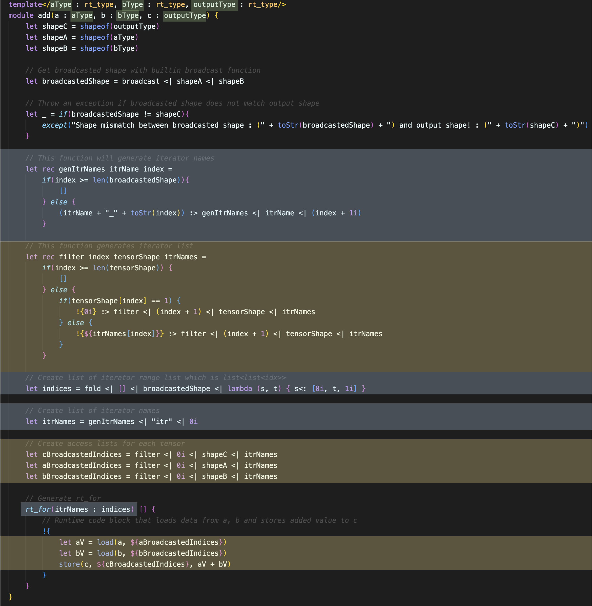
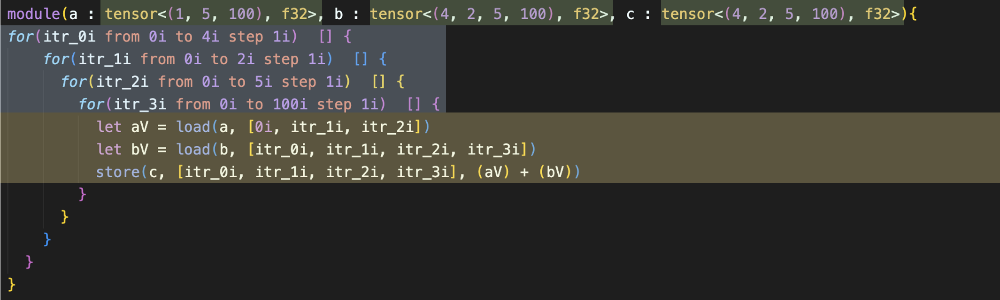

# Chapter 7. Putting it all together

We can now bring everything together and implement actual layer that can be used in OptimaV2. We will interpret 'add' kernel that will add two tensors(a and b) together and writes it to the output (c), while given shape inputs can be arbitrary.

Let's start off by defining a module.
```
template</aType : rt_type, bType : rt_type, outputType : rt_type/>
module add(a : aType, b : bType, c : outputType) {
    // implement!
}

```
We have defined type of the inputs a, b and c as an template argument. These are runtime types that will be translated into type expression in runtime code. Recall that runtime expressions and types are treated as value in compile time. Therefore, we can receive them as template argument and define type of a, b and c which are runtime arguments.

First, since shape of a,b and c are arbitrary, let's get their shapes and calculate broadcasted shape which should match the shape of the output 'c'.

```
template</aType : rt_type, bType : rt_type, outputType : rt_type/>
module add(a : aType, b : bType, c : outputType) {
    let shapeC = shapeof(outputType)
    let shapeA = shapeof(aType)
    let shapeB = shapeof(bType)

    // Get broadcasted shape with builtin broadcast function
    let broadcastedShape = broadcast <| shapeA <| shapeB

    // Throw an exception if broadcasted shape does not match output shape
    let _ = if(broadcastedShape != shapeC){
        except("Shape mismatch between broadcasted shape : (" + toStr(broadcastedShape) + ") and output shape! : (" + toStr(shapeC) + ")")
    }

    // Implement!
}
```
Now we have calculated broadcated shape using builtin broadcast function. After that, broadcasted shape is compared with shapeC and exception is thrown if shape does not match.

Since shape is arbitrary, we cannot determine exactly how many for loops are required to iterate through the tensors. Therefore, we have to use 'rt_for' to generate arbitrary number of nested runtime loops. To do so, we need appropriate iterator names, and range lists.

Following function generates iterator name lists. With the prefix saved in 'itrName' value, this function will generate list of string, each element representing iterator name for each loop. If 'itrName' is "itr", return value of this function would look like ["itr_0", "itr_1", ..., "itr_n"] where n equals (length of broadcastedShape - 1).

```
let rec genItrNames itrName index = 
    if(index >= len(broadcastedShape)){
        []
    } else {
        (itrName + "_" + toStr(index)) :> genItrNames <| itrName <| (index + 1)
    }

```

Moreover, we have to create runtime list to access each tensor. This access list should be different according to how shape was broadcasted. We should not put iterator over the number of dimensions of given tensor, and index should be always zero if corresponding dimension has only one element.

Following function will generate appropriate access list, we define 'filter' function, which will put zero if corresponding dimension has one element. Otherwise, dimension will be iterated with iterator variable representing current dimension.

```
let rec filter index tensorShape itrNames = 
    if(index >= len(tensorShape)) {
        []
    } else {
        if(tensorShape[index] == 1) {
            !{0i} :> filter <| (index + 1) <| tensorShape <| itrNames
        } else {
            !{${itrNames[index]}} :> filter <| (index + 1) <| tensorShape <| itrNames
        }
    }
```

Now we are ready to generate iterator names, iterator range, and access list.

```
template</aType : rt_type, bType : rt_type, outputType : rt_type/>
module add(a : aType, b : bType, c : outputType) {
    let shapeC = shapeof(outputType)
    let shapeA = shapeof(aType)
    let shapeB = shapeof(bType)

    // Get broadcasted shape with builtin broadcast function
    // We use builtin broadcast function here. This builtin function will automatically broadcast two shapes if they are broadcastable.
    // Refer to Chapter 6 for more information
    let broadcastedShape = broadcast <| shapeA <| shapeB

    // Throw an exception if broadcasted shape does not match output shape
    let _ = if(broadcastedShape != shapeC){
        // 'except' keyword throws exception with given messages below 
        except("Shape mismatch between broadcasted shape : (" + toStr(broadcastedShape) + ") and output shape! : (" + toStr(shapeC) + ")")
    }

    // This function will generate iterator names
    let rec genItrNames itrName index = 
        if(index >= len(broadcastedShape)){
            []
        } else {
            (itrName + "_" + toStr(index)) :> genItrNames <| itrName <| (index + 1)
        }

    // This function generates iterator list
    // Note how filter function generates filtered outputs
    let rec filter index tensorShape itrNames = 
        if(index >= len(tensorShape)) {
            []
        } else {
            if(tensorShape[index] == 1) {
                !{0i} :> filter <| (index + 1) <| tensorShape <| itrNames
            } else {
                !{${itrNames[index]}} :> filter <| (index + 1) <| tensorShape <| itrNames
            }
        }

    // Create list of iterator range list which is list<list<idx>>
    // We use 'fold' builtin function to achieve this. This will gather all iterator range and put them into the list.
    // For more information about 'fold', go back to Chapter 6.
    let indices = fold <| [] <| broadcastedShape <| lambda (s, t) { s<: [0i, t, 1i] }
    // Create list of iterator names
    let itrNames = genItrNames <| "itr" <| 0i
    // Create access lists for each tensor
    let cBroadcastedIndices = filter <| 0i <| shapeC <| itrNames
    let aBroadcastedIndices = filter <| 0i <| shapeA <| itrNames
    let bBroadcastedIndices = filter <| 0i <| shapeB <| itrNames

    // Implement
}
```

Now we can finish writing this layer by calling rt_for and geneting the nested loop we want.

```
template</aType : rt_type, bType : rt_type, outputType : rt_type/>
module add(a : aType, b : bType, c : outputType) {
    let shapeC = shapeof(outputType)
    let shapeA = shapeof(aType)
    let shapeB = shapeof(bType)

    // Get broadcasted shape with builtin broadcast function
    let broadcastedShape = broadcast <| shapeA <| shapeB

    // Throw an exception if broadcasted shape does not match output shape
    let _ = if(broadcastedShape != shapeC){
        except("Shape mismatch between broadcasted shape : (" + toStr(broadcastedShape) + ") and output shape! : (" + toStr(shapeC) + ")")
    }

    // This function will generate iterator names
    let rec genItrNames itrName index = 
        if(index >= len(broadcastedShape)){
            []
        } else {
            (itrName + "_" + toStr(index)) :> genItrNames <| itrName <| (index + 1i)
        }

    // This function generates iterator list
    let rec filter index tensorShape itrNames = 
        if(index >= len(tensorShape)) {
            []
        } else {
            if(tensorShape[index] == 1) {
                !{0i} :> filter <| (index + 1) <| tensorShape <| itrNames
            } else {
                !{${itrNames[index]}} :> filter <| (index + 1) <| tensorShape <| itrNames
            }
        }

    // Create list of iterator range list which is list<list<idx>>
    let indices = fold <| [] <| broadcastedShape <| lambda (s, t) { s<: [0i, t, 1i] }

    // Create list of iterator names
    let itrNames = genItrNames <| "itr" <| 0i

    // Create access lists for each tensor
    let cBroadcastedIndices = filter <| 0i <| shapeC <| itrNames
    let aBroadcastedIndices = filter <| 0i <| shapeA <| itrNames
    let bBroadcastedIndices = filter <| 0i <| shapeB <| itrNames

    // Generate rt_for 
    rt_for(itrNames : indices) [] {
        // Runtime code block that loads data from a, b and stores added value to c
        !{
            let aV = load(a, ${aBroadcastedIndices})
            let bV = load(b, ${bBroadcastedIndices})
            store(c, ${cBroadcastedIndices}, aV + bV)
        }
    }
}
```

That's it! we have created our layer that adds two tensors element-wise regardless of their input shapes (As long as they are broadcastable and conditions are met).

Let's see how our add layer is converted to runtime code. Let's give these parameters, and run our code.
(aType : tensor<(1,5,100), f32>, bType : tensor<(4,2,5,100), f32>, outputType : tensor<(4,2,5,100), f32>)

```python
import opto

opto.OptoLayerInstance("add", "add.opto", "add_rt.opto")
layer.add_param("aType", opto.RtTensorType([1, 5, 100], opto.NumberType.F32))
layer.add_param("bType", opto.RtTensorType([4, 2, 5, 100], opto.NumberType.F32))
layer.add_param("outputType", opto.RtTensorType([4, 2, 5, 100], opto.NumberType.F32))
layer.compile(1)
```

Here is the output (add_rt.opto).
```
module(a : tensor<(1, 5, 100), f32>, b : tensor<(4, 2, 5, 100), f32>, c : tensor<(4, 2, 5, 100), f32>){
for(itr_0i from 0i to 4i step 1i)  [] {
    for(itr_1i from 0i to 2i step 1i)  [] {
      for(itr_2i from 0i to 5i step 1i)  [] {
        for(itr_3i from 0i to 100i step 1i)  [] {
          let aV = load(a, [0i, itr_1i, itr_2i])
          let bV = load(b, [itr_0i, itr_1i, itr_2i, itr_3i])
          store(c, [itr_0i, itr_1i, itr_2i, itr_3i], (aV) + (bV))
        }
      }
    }
  }
}
```

How cool is that? Our compile time code has generated runtime code that has successfully calculated broadcasted shape (4, 2, 5, 100) and coverted it into nested loop. Note how access list was generated. They are correctly indexing our tensors, despite they are broadcasted. Now our runtime code will be further lowered down to binary by OptimaV2 tranlation units, and become executable binary that computer can run.

What if dimension(or shape) of inputs change? Without power of Opto, we would have to rewrite the whole code, with modified number of loops and indices. If we have to do this every time, It will be very inefficient and time consuming. However, with opto this kind of task is piece of cake. We can simply give different inputs as template arguments, and our Opto code will generate appropriate code.

Let's change shape of input 'a' like following:

* a : (3, 1, 2, 5, 100)
* b : (4, 2, 5, 100)
* c : (3, 4, 2, 5, 100)

Let's run it with new shapes.
```python
import opto

opto.OptoLayerInstance("add", "add.opto", "add_rt.opto")
layer.add_param("aType", opto.RtTensorType([3, 1, 5, 100], opto.NumberType.F32))
layer.add_param("bType", opto.RtTensorType([4, 2, 5, 100], opto.NumberType.F32))
layer.add_param("outputType", opto.RtTensorType([3, 4, 2, 5, 100], opto.NumberType.F32))
layer.compile(1)
```

Following code is generated runtime code output from our Opto implementation.
```
module(a : tensor<(3, 1, 2, 5, 100), f32>, b : tensor<(4, 2, 5, 100), f32>, c : tensor<(3, 4, 2, 5, 100), f32>){
for(itr_0i from 0i to 3i step 1i)  [] { // This loop has been added automatically by our Opto implementation
    for(itr_1 from 0i to 4i step 1i)  [] {
      for(itr_2 from 0i to 2i step 1i)  [] {
        for(itr_3 from 0i to 5i step 1i)  [] {
          for(itr_4 from 0i to 100i step 1i)  [] {
            let aV = load(a, [itr_0i, 0i, itr_2, itr_3, itr_4]) // Observe how iterator indices has changed to follow the new shape
            let bV = load(b, [itr_0i, itr_1, itr_2, itr_3])
            store(c, [itr_0i, itr_1, itr_2, itr_3, itr_4], (aV) + (bV))
          }
        }
      }
    }
  }
}
```
We can observe our opto copmiler has successfully generated one more loop for added dimension.

In the below figure, you can observe which part of our compile-time code is generating specific part of runtime output. This will help you to recap how compile time code generates runtime code. 

__Compile time add__



__Generated runtime output__


Code blocks highlighted in yellow generates indices used to load and store from tensors while code blocks highlighted in blue generates for loops.
Lastly, code blocks highlighted in green indicates runtime types given as static template arguments.
It is best to follow the code again and see how each part of compile time code generates runtime code.

Now, you have gone through all tutorials I have prepared. I hope you enjoy programming in Opto. If you need more information, you can refer to our reference page in notion (This will be moved to another document in the near future), or contact me directly! (email : <jaewoo.kim@enerzai.com>).
